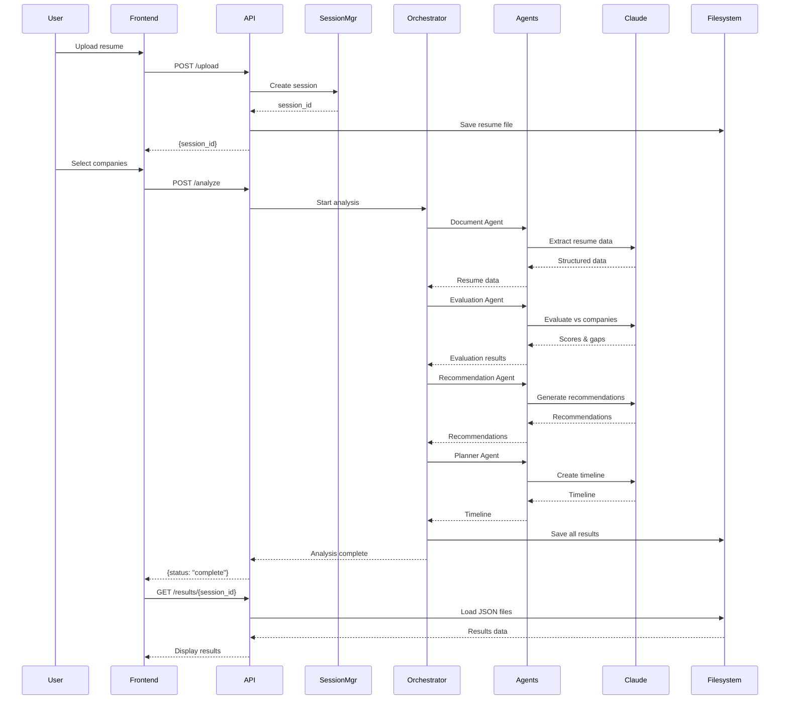

# Technical Design Document: Ready2Intern POC

**Version:** 1.0  
**Date:** January 10, 2026  
**Status:** POC Phase  
**Related Documents:** Ready2Intern-PRD.md, POC-Architecture-Summary.md

---

## Table of Contents

1. [System Architecture](#1-system-architecture)
2. [Technology Stack](#2-technology-stack)
3. [Project Structure](#3-project-structure)
4. [Backend Design](#4-backend-design)
5. [Multi-Agent System](#5-multi-agent-system)
6. [API Specification](#6-api-specification)
7. [Data Models](#7-data-models)
8. [Frontend Architecture](#8-frontend-architecture)
9. [File Storage System](#9-file-storage-system)
10. [LLM Integration](#10-llm-integration)
11. [Error Handling](#11-error-handling)
12. [Security Considerations](#12-security-considerations)
13. [Development Workflow](#13-development-workflow)
14. [Testing Strategy](#14-testing-strategy)
15. [Deployment](#15-deployment)

---

## 1. System Architecture

### 1.1 High-Level Architecture

```
┌─────────────────────────────────────────────────────────────┐
│                    Browser (Client)                          │
│  ┌────────────┐  ┌────────────┐  ┌─────────────┐           │
│  │   Upload   │  │  Company   │  │   Results   │           │
│  │    Page    │→ │  Selection │→ │  Dashboard  │           │
│  └────────────┘  └────────────┘  └─────────────┘           │
└────────────────────────┬────────────────────────────────────┘
                         │ HTTP/REST (JSON)
┌────────────────────────▼────────────────────────────────────┐
│                  FastAPI Backend (Python)                    │
│  ┌──────────────────────────────────────────────────────┐  │
│  │              API Endpoints                            │  │
│  │  /upload  /analyze  /results/{id}  /download/{id}   │  │
│  └────────────────────┬─────────────────────────────────┘  │
│                       │                                      │
│  ┌────────────────────▼─────────────────────────────────┐  │
│  │          Session Manager (In-Memory)                  │  │
│  │  - Generate session IDs                               │  │
│  │  - Track analysis state                               │  │
│  │  - Store temporary data                               │  │
│  └────────────────────┬─────────────────────────────────┘  │
│                       │                                      │
│  ┌────────────────────▼─────────────────────────────────┐  │
│  │          Agent Orchestrator                           │  │
│  │  - Coordinate agent execution                         │  │
│  │  - Manage agent state                                 │  │
│  │  - Handle agent communication                         │  │
│  └──┬───────┬────────┬────────┬──────────────────────────┘  │
│     │       │        │        │                             │
│  ┌──▼──┐ ┌─▼───┐ ┌──▼───┐ ┌─▼────┐                        │
│  │Doc  │ │Eval │ │Recom │ │Plan  │  Specialized Agents    │
│  │Agent│ │Agent│ │Agent │ │Agent │                         │
│  └──┬──┘ └─┬───┘ └──┬───┘ └─┬────┘                        │
│     └──────┴────────┴────────┘                             │
│              │                                               │
│  ┌───────────▼──────────────────────────────────────────┐  │
│  │          Anthropic Claude API Client                  │  │
│  │  - API key management                                 │  │
│  │  - Request/response handling                          │  │
│  │  - Retry logic & error handling                       │  │
│  └───────────┬──────────────────────────────────────────┘  │
└──────────────┼──────────────────────────────────────────────┘
               │
┌──────────────▼──────────────────────────────────────────────┐
│           Anthropic Claude API (External)                    │
│  Model: claude-sonnet-4-20250514                            │
│  Features: Extended thinking, structured outputs            │
└─────────────────────────────────────────────────────────────┘

┌─────────────────────────────────────────────────────────────┐
│              Local Filesystem Storage                        │
│  uploads/        company_tenets/        results/            │
│  └─{sid}/        ├─amazon.md            └─{sid}/            │
│    └─resume.pdf  ├─meta.md               ├─evaluation.json  │
│                  └─google.md             ├─recommendations...│
│                                          ├─timeline.json     │
│                                          └─report.pdf        │
└─────────────────────────────────────────────────────────────┘
```

### 1.2 Data Flow Diagram

```
┌─────────┐
│ Upload  │
│ Resume  │
└────┬────┘
     │
     ▼
┌─────────────────┐
│ Generate UUID   │
│ session_id      │
└────┬────────────┘
     │
     ▼
┌─────────────────┐
│ Save to         │
│ ./uploads/{sid}/│
└────┬────────────┘
     │
     ▼
┌─────────────────┐
│ Document Agent  │
│ Extract Data    │ ──► In-Memory Session Dict
└────┬────────────┘
     │
     ▼
┌─────────────────┐
│ User Selects    │
│ Companies       │ ──► Update Session Dict
└────┬────────────┘
     │
     ▼
┌─────────────────┐
│ Evaluation Agent│
│ Score Resume    │ ──► evaluation.json
└────┬────────────┘
     │
     ▼
┌─────────────────┐
│ Recommendation  │
│ Agent           │ ──► recommendations.json
└────┬────────────┘
     │
     ▼
┌─────────────────┐
│ Planner Agent   │
│ Generate Timeline│ ──► timeline.json
└────┬────────────┘
     │
     ▼
┌─────────────────┐
│ Report Generator│
│ Create PDF      │ ──► report.pdf
└────┬────────────┘
     │
     ▼
┌─────────────────┐
│ Return Results  │
│ to Frontend     │
└─────────────────┘
```

### 1.3 Component Interaction



---

## 2. Technology Stack

### 2.1 Backend

| Component | Technology | Version | Purpose |
|-----------|-----------|---------|---------|
| **Language** | Python | 3.11+ | Core backend language |
| **Package Manager** | uv | latest | Fast dependency management |
| **Web Framework** | FastAPI | 0.109+ | REST API framework |
| **ASGI Server** | Uvicorn | 0.27+ | Production server |
| **LLM Client** | anthropic | 0.39+ | Claude API integration |
| **PDF Parsing** | pdfplumber | 0.11+ | PDF text extraction |
| **DOCX Parsing** | python-docx | 1.1+ | DOCX text extraction |
| **PDF Generation** | reportlab | 4.0+ | PDF report creation |
| **Validation** | Pydantic | 2.5+ | Data validation |
| **Environment** | python-dotenv | 1.0+ | Config management |
| **HTTP Client** | httpx | 0.26+ | Async HTTP requests |
| **Logging** | structlog | 24.1+ | Structured logging |

### 2.2 Frontend

| Component | Technology | Version | Purpose |
|-----------|-----------|---------|---------|
| **Framework** | React | 18+ | UI framework |
| **Language** | TypeScript | 5+ | Type-safe JavaScript |
| **Build Tool** | Vite | 5+ | Fast build tool |
| **Styling** | Tailwind CSS | 3+ | Utility-first CSS |
| **HTTP Client** | Axios | 1.6+ | API communication |
| **State Management** | Zustand | 4+ | Lightweight state |
| **Routing** | React Router | 6+ | Client-side routing |
| **Forms** | React Hook Form | 7+ | Form handling |
| **Charts** | Recharts | 2+ | Data visualization |
| **Icons** | Lucide React | latest | Icon library |
| **File Upload** | react-dropzone | 14+ | Drag-drop upload |

### 2.3 Development Tools

| Tool | Purpose |
|------|---------|
| **Ruff** | Python linting & formatting |
| **mypy** | Python type checking |
| **pytest** | Python testing |
| **ESLint** | JavaScript/TypeScript linting |
| **Prettier** | Code formatting |
| **Vitest** | Frontend testing |

---

## 3. Project Structure

### 3.1 Directory Layout

```
ready2intern/
├── backend/
│   ├── app/
│   │   ├── __init__.py
│   │   ├── main.py                 # FastAPI app entry point
│   │   ├── config.py               # Configuration settings
│   │   ├── api/
│   │   │   ├── __init__.py
│   │   │   ├── routes.py           # API route definitions
│   │   │   └── dependencies.py     # Dependency injection
│   │   ├── agents/
│   │   │   ├── __init__.py
│   │   │   ├── base.py             # Base agent class
│   │   │   ├── orchestrator.py     # Agent orchestrator
│   │   │   ├── document_agent.py   # Resume parsing agent
│   │   │   ├── evaluation_agent.py # Company evaluation agent
│   │   │   ├── recommendation_agent.py
│   │   │   └── planner_agent.py    # Timeline planning agent
│   │   ├── models/
│   │   │   ├── __init__.py
│   │   │   ├── session.py          # Session data models
│   │   │   ├── resume.py           # Resume data models
│   │   │   ├── evaluation.py       # Evaluation data models
│   │   │   └── recommendation.py   # Recommendation models
│   │   ├── services/
│   │   │   ├── __init__.py
│   │   │   ├── claude_client.py    # Anthropic API client
│   │   │   ├── file_service.py     # File operations
│   │   │   ├── session_service.py  # Session management
│   │   │   └── report_service.py   # PDF generation
│   │   ├── prompts/
│   │   │   ├── __init__.py
│   │   │   ├── document_prompts.py
│   │   │   ├── evaluation_prompts.py
│   │   │   ├── recommendation_prompts.py
│   │   │   └── planner_prompts.py
│   │   └── utils/
│   │       ├── __init__.py
│   │       ├── logger.py           # Logging setup
│   │       └── validators.py       # Input validation
│   ├── tests/
│   │   ├── __init__.py
│   │   ├── test_api.py
│   │   ├── test_agents.py
│   │   └── test_services.py
│   ├── pyproject.toml              # uv project config
│   ├── requirements.txt            # Dependencies
│   └── .env.example                # Environment template
│
├── frontend/
│   ├── src/
│   │   ├── main.tsx                # App entry point
│   │   ├── App.tsx                 # Root component
│   │   ├── components/
│   │   │   ├── upload/
│   │   │   │   ├── ResumeUpload.tsx
│   │   │   │   └── FileDropzone.tsx
│   │   │   ├── company/
│   │   │   │   ├── CompanySelector.tsx
│   │   │   │   └── CompanyCard.tsx
│   │   │   ├── results/
│   │   │   │   ├── ResultsDashboard.tsx
│   │   │   │   ├── ScoreCard.tsx
│   │   │   │   ├── GapAnalysis.tsx
│   │   │   │   ├── Recommendations.tsx
│   │   │   │   └── Timeline.tsx
│   │   │   ├── common/
│   │   │   │   ├── Button.tsx
│   │   │   │   ├── Card.tsx
│   │   │   │   ├── Loading.tsx
│   │   │   │   └── ErrorMessage.tsx
│   │   │   └── layout/
│   │   │       ├── Header.tsx
│   │   │       └── Footer.tsx
│   │   ├── pages/
│   │   │   ├── HomePage.tsx
│   │   │   ├── UploadPage.tsx
│   │   │   ├── CompanySelectionPage.tsx
│   │   │   ├── AnalysisPage.tsx
│   │   │   └── ResultsPage.tsx
│   │   ├── services/
│   │   │   └── api.ts              # API client
│   │   ├── store/
│   │   │   └── useAppStore.ts      # Zustand store
│   │   ├── types/
│   │   │   └── index.ts            # TypeScript types
│   │   └── utils/
│   │       └── helpers.ts
│   ├── public/
│   ├── index.html
│   ├── package.json
│   ├── tsconfig.json
│   ├── vite.config.ts
│   └── tailwind.config.js
│
├── data/
│   ├── uploads/                    # User-uploaded resumes
│   ├── company_tenets/             # Company evaluation criteria
│   │   ├── amazon.md
│   │   ├── meta.md
│   │   └── google.md
│   └── results/                    # Analysis results
│
├── docs/
│   ├── Ready2Intern-PRD.md
│   ├── Ready2Intern-TDD.md
│   └── POC-Architecture-Summary.md
│
├── .gitignore
├── README.md
└── docker-compose.yml              # Optional: for containerization
```

### 3.2 Configuration Files

**backend/pyproject.toml**
```toml
[project]
name = "ready2intern-backend"
version = "0.1.0"
description = "Ready2Intern POC Backend"
requires-python = ">=3.11"
dependencies = [
    "fastapi>=0.109.0",
    "uvicorn[standard]>=0.27.0",
    "anthropic>=0.39.0",
    "pydantic>=2.5.0",
    "pydantic-settings>=2.1.0",
    "python-dotenv>=1.0.0",
    "pdfplumber>=0.11.0",
    "python-docx>=1.1.0",
    "reportlab>=4.0.0",
    "httpx>=0.26.0",
    "structlog>=24.1.0",
    "python-multipart>=0.0.6",
]

[project.optional-dependencies]
dev = [
    "pytest>=7.4.0",
    "pytest-asyncio>=0.21.0",
    "pytest-cov>=4.1.0",
    "ruff>=0.1.0",
    "mypy>=1.7.0",
]

[tool.ruff]
line-length = 100
target-version = "py311"

[tool.mypy]
python_version = "3.11"
strict = true
```

**frontend/package.json**
```json
{
  "name": "ready2intern-frontend",
  "version": "0.1.0",
  "type": "module",
  "scripts": {
    "dev": "vite",
    "build": "tsc && vite build",
    "preview": "vite preview",
    "lint": "eslint . --ext ts,tsx",
    "format": "prettier --write \"src/**/*.{ts,tsx}\""
  },
  "dependencies": {
    "react": "^18.2.0",
    "react-dom": "^18.2.0",
    "react-router-dom": "^6.21.0",
    "zustand": "^4.4.7",
    "axios": "^1.6.5",
    "react-hook-form": "^7.49.3",
    "react-dropzone": "^14.2.3",
    "recharts": "^2.10.3",
    "lucide-react": "^0.309.0"
  },
  "devDependencies": {
    "@types/react": "^18.2.48",
    "@types/react-dom": "^18.2.18",
    "@vitejs/plugin-react": "^4.2.1",
    "typescript": "^5.3.3",
    "vite": "^5.0.11",
    "tailwindcss": "^3.4.1",
    "autoprefixer": "^10.4.16",
    "postcss": "^8.4.33",
    "eslint": "^8.56.0",
    "prettier": "^3.1.1",
    "vitest": "^1.1.3"
  }
}
```

---

## 4. Backend Design

### 4.1 FastAPI Application Structure

**app/main.py**
```python
"""
FastAPI application entry point for Ready2Intern POC.
"""
from fastapi import FastAPI
from fastapi.middleware.cors import CORSMiddleware
from contextlib import asynccontextmanager

from app.config import settings
from app.api.routes import router
from app.utils.logger import setup_logging

# Setup logging
setup_logging()

@asynccontextmanager
async def lifespan(app: FastAPI):
    """Application lifespan manager."""
    # Startup
    print(f"🚀 Starting Ready2Intern POC on {settings.HOST}:{settings.PORT}")
    print(f"📁 Upload directory: {settings.UPLOAD_DIR}")
    print(f"📁 Results directory: {settings.RESULTS_DIR}")
    
    # Create necessary directories
    settings.UPLOAD_DIR.mkdir(parents=True, exist_ok=True)
    settings.RESULTS_DIR.mkdir(parents=True, exist_ok=True)
    settings.COMPANY_TENETS_DIR.mkdir(parents=True, exist_ok=True)
    
    yield
    
    # Shutdown
    print("👋 Shutting down Ready2Intern POC")

# Create FastAPI app
app = FastAPI(
    title="Ready2Intern API",
    description="AI-powered internship readiness platform",
    version="0.1.0",
    lifespan=lifespan,
)

# Configure CORS
app.add_middleware(
    CORSMiddleware,
    allow_origins=settings.CORS_ORIGINS,
    allow_credentials=True,
    allow_methods=["*"],
    allow_headers=["*"],
)

# Include routers
app.include_router(router, prefix="/api")

@app.get("/")
async def root():
    """Health check endpoint."""
    return {
        "status": "healthy",
        "service": "Ready2Intern POC",
        "version": "0.1.0"
    }

@app.get("/health")
async def health_check():
    """Detailed health check."""
    return {
        "status": "healthy",
        "upload_dir": str(settings.UPLOAD_DIR),
        "results_dir": str(settings.RESULTS_DIR),
        "anthropic_configured": bool(settings.ANTHROPIC_API_KEY),
    }
```

### 4.2 Configuration Management

**app/config.py**
```python
"""
Application configuration using Pydantic Settings.
"""
from pathlib import Path
from pydantic_settings import BaseSettings, SettingsConfigDict

class Settings(BaseSettings):
    """Application settings."""
    
    # API Configuration
    HOST: str = "0.0.0.0"
    PORT: int = 8000
    DEBUG: bool = True
    
    # Anthropic API
    ANTHROPIC_API_KEY: str
    ANTHROPIC_MODEL: str = "claude-sonnet-4-20250514"
    ANTHROPIC_MAX_TOKENS: int = 16000
    ANTHROPIC_TIMEOUT: int = 120
    
    # File Storage
    BASE_DIR: Path = Path(__file__).parent.parent.parent
    UPLOAD_DIR: Path = BASE_DIR / "data" / "uploads"
    RESULTS_DIR: Path = BASE_DIR / "data" / "results"
    COMPANY_TENETS_DIR: Path = BASE_DIR / "data" / "company_tenets"
    
    # File Upload Limits
    MAX_FILE_SIZE_MB: int = 5
    ALLOWED_EXTENSIONS: list[str] = [".pdf", ".docx"]
    
    # CORS
    CORS_ORIGINS: list[str] = ["http://localhost:5173", "http://localhost:3000"]
    
    # Logging
    LOG_LEVEL: str = "INFO"
    
    model_config = SettingsConfigDict(
        env_file=".env",
        env_file_encoding="utf-8",
        case_sensitive=True,
    )

# Global settings instance
settings = Settings()
```

### 4.3 Session Management

**app/services/session_service.py**
```python
"""
In-memory session management service.
"""
import uuid
from datetime import datetime
from typing import Dict, Optional
from dataclasses import dataclass, field

@dataclass
class Session:
    """Session data structure."""
    session_id: str
    created_at: datetime
    status: str  # "uploading", "analyzing", "complete", "error"
    resume_filename: Optional[str] = None
    selected_companies: list[str] = field(default_factory=list)
    extracted_data: Optional[dict] = None
    evaluation_results: Optional[dict] = None
    error_message: Optional[str] = None

class SessionService:
    """Manages in-memory sessions."""
    
    def __init__(self):
        self._sessions: Dict[str, Session] = {}
    
    def create_session(self) -> str:
        """Create a new session and return session ID."""
        session_id = str(uuid.uuid4())
        self._sessions[session_id] = Session(
            session_id=session_id,
            created_at=datetime.utcnow(),
            status="uploading"
        )
        return session_id
    
    def get_session(self, session_id: str) -> Optional[Session]:
        """Get session by ID."""
        return self._sessions.get(session_id)
    
    def update_session(self, session_id: str, **kwargs) -> None:
        """Update session data."""
        session = self._sessions.get(session_id)
        if session:
            for key, value in kwargs.items():
                if hasattr(session, key):
                    setattr(session, key, value)
    
    def delete_session(self, session_id: str) -> None:
        """Delete session from memory."""
        self._sessions.pop(session_id, None)
    
    def get_all_sessions(self) -> list[Session]:
        """Get all active sessions."""
        return list(self._sessions.values())

# Global session service instance
session_service = SessionService()
```

---

## 5. Multi-Agent System

### 5.1 Base Agent Class

**app/agents/base.py**
```python
"""
Base agent class for all specialized agents.
"""
from abc import ABC, abstractmethod
from typing import Any, Dict
import structlog

from app.services.claude_client import ClaudeClient

logger = structlog.get_logger()

class BaseAgent(ABC):
    """Base class for all agents."""
    
    def __init__(self, claude_client: ClaudeClient):
        self.claude_client = claude_client
        self.logger = logger.bind(agent=self.__class__.__name__)
    
    @abstractmethod
    async def execute(self, context: Dict[str, Any]) -> Dict[str, Any]:
        """
        Execute the agent's main task.
        
        Args:
            context: Input context containing necessary data
            
        Returns:
            Dict containing agent's output
        """
        pass
    
    async def _call_claude(
        self,
        prompt: str,
        system_prompt: str = "",
        temperature: float = 1.0,
        use_thinking: bool = True,
    ) -> str:
        """
        Helper method to call Claude API.
        
        Args:
            prompt: User prompt
            system_prompt: System prompt
            temperature: Sampling temperature
            use_thinking: Whether to use extended thinking
            
        Returns:
            Claude's response text
        """
        self.logger.info("calling_claude", prompt_length=len(prompt))
        
        response = await self.claude_client.create_message(
            prompt=prompt,
            system_prompt=system_prompt,
            temperature=temperature,
            use_thinking=use_thinking,
        )
        
        self.logger.info("claude_response_received", response_length=len(response))
        return response
    
    def _log_execution(self, stage: str, **kwargs):
        """Log agent execution stage."""
        self.logger.info(f"agent_{stage}", **kwargs)
```

### 5.2 Agent Orchestrator

**app/agents/orchestrator.py**
```python
"""
Agent orchestrator - coordinates multi-agent workflow.
"""
from typing import Dict, Any
import structlog

from app.agents.document_agent import DocumentAgent
from app.agents.evaluation_agent import EvaluationAgent
from app.agents.recommendation_agent import RecommendationAgent
from app.agents.planner_agent import PlannerAgent
from app.services.claude_client import ClaudeClient
from app.services.file_service import FileService

logger = structlog.get_logger()

class AgentOrchestrator:
    """Orchestrates the multi-agent workflow."""
    
    def __init__(
        self,
        claude_client: ClaudeClient,
        file_service: FileService,
    ):
        self.claude_client = claude_client
        self.file_service = file_service
        
        # Initialize agents
        self.document_agent = DocumentAgent(claude_client)
        self.evaluation_agent = EvaluationAgent(claude_client)
        self.recommendation_agent = RecommendationAgent(claude_client)
        self.planner_agent = PlannerAgent(claude_client)
        
        self.logger = logger.bind(component="orchestrator")
    
    async def run_analysis(
        self,
        session_id: str,
        resume_path: str,
        selected_companies: list[str],
    ) -> Dict[str, Any]:
        """
        Run the complete analysis workflow.
        
        Args:
            session_id: Unique session identifier
            resume_path: Path to uploaded resume
            selected_companies: List of company names
            
        Returns:
            Complete analysis results
        """
        self.logger.info("starting_analysis", session_id=session_id)
        
        try:
            # Stage 1: Document Processing
            self.logger.info("stage_1_document_processing")
            resume_text = await self.file_service.extract_text(resume_path)
            document_context = {
                "resume_text": resume_text,
                "session_id": session_id,
            }
            extracted_data = await self.document_agent.execute(document_context)
            
            # Stage 2: Company Evaluation
            self.logger.info("stage_2_evaluation", companies=selected_companies)
            evaluation_context = {
                "resume_data": extracted_data,
                "companies": selected_companies,
                "session_id": session_id,
            }
            evaluation_results = await self.evaluation_agent.execute(evaluation_context)
            
            # Stage 3: Recommendations
            self.logger.info("stage_3_recommendations")
            recommendation_context = {
                "resume_data": extracted_data,
                "evaluation_results": evaluation_results,
                "companies": selected_companies,
            }
            recommendations = await self.recommendation_agent.execute(
                recommendation_context
            )
            
            # Stage 4: Timeline Planning
            self.logger.info("stage_4_timeline")
            planner_context = {
                "resume_data": extracted_data,
                "recommendations": recommendations,
                "target_companies": selected_companies,
            }
            timeline = await self.planner_agent.execute(planner_context)
            
            # Compile final results
            results = {
                "session_id": session_id,
                "extracted_data": extracted_data,
                "evaluation": evaluation_results,
                "recommendations": recommendations,
                "timeline": timeline,
                "status": "complete",
            }
            
            # Save results to filesystem
            await self.file_service.save_results(session_id, results)
            
            self.logger.info("analysis_complete", session_id=session_id)
            return results
            
        except Exception as e:
            self.logger.error("analysis_failed", error=str(e), session_id=session_id)
            raise
```

### 5.3 Document Agent

**app/agents/document_agent.py**
```python
"""
Document Agent - Extracts structured data from resumes.
"""
from typing import Dict, Any
import json

from app.agents.base import BaseAgent
from app.prompts.document_prompts import DOCUMENT_EXTRACTION_PROMPT

class DocumentAgent(BaseAgent):
    """Extracts structured information from resume text."""
    
    async def execute(self, context: Dict[str, Any]) -> Dict[str, Any]:
        """
        Extract structured data from resume.
        
        Args:
            context: Must contain 'resume_text'
            
        Returns:
            Structured resume data
        """
        self._log_execution("start", context_keys=list(context.keys()))
        
        resume_text = context["resume_text"]
        
        # Build prompt
        prompt = DOCUMENT_EXTRACTION_PROMPT.format(resume_text=resume_text)
        
        # Call Claude with extended thinking
        response = await self._call_claude(
            prompt=prompt,
            system_prompt="You are an expert resume parser. Extract structured information accurately.",
            temperature=0.3,  # Lower temperature for factual extraction
            use_thinking=True,
        )
        
        # Parse JSON response
        try:
            extracted_data = json.loads(response)
        except json.JSONDecodeError:
            # If response isn't valid JSON, try to extract it
            import re
            json_match = re.search(r'\{.*\}', response, re.DOTALL)
            if json_match:
                extracted_data = json.loads(json_match.group())
            else:
                raise ValueError("Failed to parse JSON from Claude response")
        
        self._log_execution("complete", extracted_fields=list(extracted_data.keys()))
        return extracted_data
```

### 5.4 Evaluation Agent

**app/agents/evaluation_agent.py**
```python
"""
Evaluation Agent - Evaluates resumes against company criteria.
"""
from typing import Dict, Any
import json

from app.agents.base import BaseAgent
from app.prompts.evaluation_prompts import get_evaluation_prompt
from app.services.file_service import FileService

class EvaluationAgent(BaseAgent):
    """Evaluates resume against company-specific criteria."""
    
    def __init__(self, claude_client, file_service: FileService = None):
        super().__init__(claude_client)
        self.file_service = file_service or FileService()
    
    async def execute(self, context: Dict[str, Any]) -> Dict[str, Any]:
        """
        Evaluate resume for selected companies.
        
        Args:
            context: Must contain 'resume_data' and 'companies'
            
        Returns:
            Evaluation results for each company
        """
        self._log_execution("start", companies=context["companies"])
        
        resume_data = context["resume_data"]
        companies = context["companies"]
        
        evaluations = []
        
        for company in companies:
            self.logger.info("evaluating_company", company=company)
            
            # Load company tenets
            tenets = await self.file_service.load_company_tenets(company)
            
            # Build evaluation prompt
            prompt = get_evaluation_prompt(
                resume_data=resume_data,
                company=company,
                tenets=tenets,
            )
            
            # Call Claude
            response = await self._call_claude(
                prompt=prompt,
                system_prompt=f"You are an expert at evaluating candidates for {company} internships.",
                temperature=0.7,
                use_thinking=True,
            )
            
            # Parse response
            evaluation = json.loads(response)
            evaluation["company"] = company
            evaluations.append(evaluation)
        
        result = {
            "evaluations": evaluations,
            "overall_summary": self._generate_summary(evaluations),
        }
        
        self._log_execution("complete", num_evaluations=len(evaluations))
        return result
    
    def _generate_summary(self, evaluations: list) -> Dict[str, Any]:
        """Generate overall summary across companies."""
        avg_score = sum(e.get("overall_score", 0) for e in evaluations) / len(evaluations)
        best_fit = max(evaluations, key=lambda e: e.get("overall_score", 0))
        
        return {
            "average_score": avg_score,
            "best_fit_company": best_fit["company"],
            "best_fit_score": best_fit.get("overall_score", 0),
        }
```

### 5.5 Recommendation Agent

**app/agents/recommendation_agent.py**
```python
"""
Recommendation Agent - Generates actionable recommendations.
"""
from typing import Dict, Any
import json

from app.agents.base import BaseAgent
from app.prompts.recommendation_prompts import RECOMMENDATION_PROMPT

class RecommendationAgent(BaseAgent):
    """Generates prioritized recommendations for improvement."""
    
    async def execute(self, context: Dict[str, Any]) -> Dict[str, Any]:
        """
        Generate recommendations based on evaluation.
        
        Args:
            context: Must contain 'resume_data', 'evaluation_results', 'companies'
            
        Returns:
            Prioritized recommendations
        """
        self._log_execution("start")
        
        resume_data = context["resume_data"]
        evaluation_results = context["evaluation_results"]
        companies = context["companies"]
        
        # Build prompt
        prompt = RECOMMENDATION_PROMPT.format(
            resume_data=json.dumps(resume_data, indent=2),
            evaluation_results=json.dumps(evaluation_results, indent=2),
            companies=", ".join(companies),
        )
        
        # Call Claude
        response = await self._call_claude(
            prompt=prompt,
            system_prompt="You are a career advisor specializing in tech internships.",
            temperature=0.8,
            use_thinking=True,
        )
        
        # Parse response
        recommendations = json.loads(response)
        
        self._log_execution(
            "complete",
            num_recommendations=len(recommendations.get("recommendations", []))
        )
        return recommendations
```

### 5.6 Planner Agent

**app/agents/planner_agent.py**
```python
"""
Planner Agent - Creates timeline-based development plans.
"""
from typing import Dict, Any
import json
from datetime import datetime, timedelta

from app.agents.base import BaseAgent
from app.prompts.planner_prompts import PLANNER_PROMPT

class PlannerAgent(BaseAgent):
    """Creates timeline-based development plans."""
    
    async def execute(self, context: Dict[str, Any]) -> Dict[str, Any]:
        """
        Generate development timeline.
        
        Args:
            context: Must contain 'resume_data', 'recommendations', 'target_companies'
            
        Returns:
            Timeline with phases and milestones
        """
        self._log_execution("start")
        
        resume_data = context["resume_data"]
        recommendations = context["recommendations"]
        target_companies = context["target_companies"]
        
        # Calculate typical internship application deadline (Sept 1)
        current_date = datetime.now()
        if current_date.month >= 9:
            # Next year
            target_deadline = datetime(current_date.year + 1, 9, 1)
        else:
            # This year
            target_deadline = datetime(current_date.year, 9, 1)
        
        # Build prompt
        prompt = PLANNER_PROMPT.format(
            resume_data=json.dumps(resume_data, indent=2),
            recommendations=json.dumps(recommendations, indent=2),
            target_companies=", ".join(target_companies),
            current_date=current_date.strftime("%Y-%m-%d"),
            target_deadline=target_deadline.strftime("%Y-%m-%d"),
        )
        
        # Call Claude
        response = await self._call_claude(
            prompt=prompt,
            system_prompt="You are a career planning expert for tech internships.",
            temperature=0.7,
            use_thinking=True,
        )
        
        # Parse response
        timeline = json.loads(response)
        timeline["target_deadline"] = target_deadline.isoformat()
        timeline["created_at"] = current_date.isoformat()
        
        self._log_execution(
            "complete",
            num_phases=len(timeline.get("phases", []))
        )
        return timeline
```

---

## 6. API Specification

### 6.1 API Endpoints

**app/api/routes.py**
```python
"""
API route definitions.
"""
from fastapi import APIRouter, UploadFile, File, HTTPException, BackgroundTasks
from fastapi.responses import FileResponse
from typing import List
import structlog

from app.services.session_service import session_service
from app.services.file_service import FileService
from app.services.claude_client import ClaudeClient
from app.agents.orchestrator import AgentOrchestrator
from app.models.session import SessionResponse, AnalysisRequest, AnalysisStatus
from app.config import settings

logger = structlog.get_logger()
router = APIRouter()

# Initialize services
file_service = FileService()
claude_client = ClaudeClient()
orchestrator = AgentOrchestrator(claude_client, file_service)

@router.post("/upload", response_model=SessionResponse)
async def upload_resume(file: UploadFile = File(...)):
    """
    Upload a resume file.
    
    Returns:
        SessionResponse with session_id
    """
    logger.info("upload_request", filename=file.filename)
    
    # Validate file
    if not file.filename:
        raise HTTPException(status_code=400, detail="No file provided")
    
    file_ext = file.filename.split(".")[-1].lower()
    if f".{file_ext}" not in settings.ALLOWED_EXTENSIONS:
        raise HTTPException(
            status_code=400,
            detail=f"Invalid file type. Allowed: {settings.ALLOWED_EXTENSIONS}"
        )
    
    # Check file size
    content = await file.read()
    if len(content) > settings.MAX_FILE_SIZE_MB * 1024 * 1024:
        raise HTTPException(
            status_code=400,
            detail=f"File too large. Max size: {settings.MAX_FILE_SIZE_MB}MB"
        )
    
    # Create session
    session_id = session_service.create_session()
    
    # Save file
    file_path = await file_service.save_upload(session_id, file.filename, content)
    
    # Update session
    session_service.update_session(
        session_id,
        resume_filename=file.filename,
        status="uploaded"
    )
    
    logger.info("upload_success", session_id=session_id, filename=file.filename)
    
    return SessionResponse(
        session_id=session_id,
        status="uploaded",
        message="Resume uploaded successfully"
    )

@router.post("/analyze/{session_id}", response_model=AnalysisStatus)
async def start_analysis(
    session_id: str,
    request: AnalysisRequest,
    background_tasks: BackgroundTasks,
):
    """
    Start resume analysis for selected companies.
    
    Args:
        session_id: Session identifier
        request: Analysis request with selected companies
        
    Returns:
        AnalysisStatus indicating analysis has started
    """
    logger.info("analysis_request", session_id=session_id, companies=request.companies)
    
    # Get session
    session = session_service.get_session(session_id)
    if not session:
        raise HTTPException(status_code=404, detail="Session not found")
    
    if not session.resume_filename:
        raise HTTPException(status_code=400, detail="No resume uploaded")
    
    # Update session
    session_service.update_session(
        session_id,
        selected_companies=request.companies,
        status="analyzing"
    )
    
    # Start analysis in background
    resume_path = settings.UPLOAD_DIR / session_id / session.resume_filename
    background_tasks.add_task(
        run_analysis_task,
        session_id,
        str(resume_path),
        request.companies
    )
    
    return AnalysisStatus(
        session_id=session_id,
        status="analyzing",
        message="Analysis started"
    )

async def run_analysis_task(
    session_id: str,
    resume_path: str,
    companies: List[str]
):
    """Background task to run analysis."""
    try:
        results = await orchestrator.run_analysis(
            session_id=session_id,
            resume_path=resume_path,
            selected_companies=companies
        )
        
        session_service.update_session(
            session_id,
            status="complete",
            evaluation_results=results
        )
        
    except Exception as e:
        logger.error("analysis_failed", error=str(e), session_id=session_id)
        session_service.update_session(
            session_id,
            status="error",
            error_message=str(e)
        )

@router.get("/status/{session_id}", response_model=AnalysisStatus)
async def get_analysis_status(session_id: str):
    """
    Get analysis status.
    
    Args:
        session_id: Session identifier
        
    Returns:
        Current analysis status
    """
    session = session_service.get_session(session_id)
    if not session:
        raise HTTPException(status_code=404, detail="Session not found")
    
    return AnalysisStatus(
        session_id=session_id,
        status=session.status,
        message=session.error_message or f"Status: {session.status}"
    )

@router.get("/results/{session_id}")
async def get_results(session_id: str):
    """
    Get analysis results.
    
    Args:
        session_id: Session identifier
        
    Returns:
        Complete analysis results
    """
    logger.info("results_request", session_id=session_id)
    
    # Check session
    session = session_service.get_session(session_id)
    if not session:
        raise HTTPException(status_code=404, detail="Session not found")
    
    if session.status != "complete":
        raise HTTPException(
            status_code=400,
            detail=f"Analysis not complete. Status: {session.status}"
        )
    
    # Load results from filesystem
    try:
        results = await file_service.load_results(session_id)
        return results
    except FileNotFoundError:
        raise HTTPException(status_code=404, detail="Results not found")

@router.get("/download/{session_id}/report")
async def download_report(session_id: str):
    """
    Download PDF report.
    
    Args:
        session_id: Session identifier
        
    Returns:
        PDF file
    """
    logger.info("download_request", session_id=session_id)
    
    report_path = settings.RESULTS_DIR / session_id / "report.pdf"
    
    if not report_path.exists():
        raise HTTPException(status_code=404, detail="Report not found")
    
    return FileResponse(
        path=report_path,
        media_type="application/pdf",
        filename=f"ready2intern_report_{session_id[:8]}.pdf"
    )

@router.delete("/session/{session_id}")
async def delete_session(session_id: str):
    """
    Delete session and associated files.
    
    Args:
        session_id: Session identifier
        
    Returns:
        Success message
    """
    logger.info("delete_request", session_id=session_id)
    
    # Delete from memory
    session_service.delete_session(session_id)
    
    # Delete files
    await file_service.delete_session_files(session_id)
    
    return {"message": "Session deleted successfully"}
```

### 6.2 Request/Response Models

**app/models/session.py**
```python
"""
Pydantic models for API requests and responses.
"""
from pydantic import BaseModel, Field
from typing import Optional, List
from datetime import datetime

class SessionResponse(BaseModel):
    """Response after creating a session."""
    session_id: str
    status: str
    message: str

class AnalysisRequest(BaseModel):
    """Request to start analysis."""
    companies: List[str] = Field(..., min_items=1, max_items=3)
    target_deadline: Optional[str] = None  # ISO date format

class AnalysisStatus(BaseModel):
    """Analysis status response."""
    session_id: str
    status: str  # "uploading", "uploaded", "analyzing", "complete", "error"
    message: str
    progress: Optional[int] = None  # 0-100

class CompanyEvaluation(BaseModel):
    """Company-specific evaluation."""
    company: str
    overall_score: float
    category_scores: dict
    strengths: List[str]
    gaps: List[str]

class Recommendation(BaseModel):
    """Single recommendation."""
    priority: str  # "high", "medium", "low"
    category: str
    action: str
    rationale: str
    timeline: str
    resources: Optional[List[str]] = None

class TimelinePhase(BaseModel):
    """Timeline phase."""
    name: str
    duration_weeks: int
    start_date: str
    end_date: str
    goals: List[str]
    actions: List[str]

class AnalysisResults(BaseModel):
    """Complete analysis results."""
    session_id: str
    timestamp: datetime
    student_info: dict
    evaluations: List[CompanyEvaluation]
    recommendations: List[Recommendation]
    timeline: dict
    overall_summary: dict
```

---

## 7. Data Models

### 7.1 Resume Data Model

**app/models/resume.py**
```python
"""
Resume data models.
"""
from pydantic import BaseModel, Field, EmailStr
from typing import Optional, List
from datetime import date

class StudentInfo(BaseModel):
    """Student personal information."""
    name: str
    email: Optional[EmailStr] = None
    phone: Optional[str] = None
    linkedin: Optional[str] = None
    github: Optional[str] = None
    location: Optional[str] = None

class Education(BaseModel):
    """Education entry."""
    institution: str
    degree: str
    major: str
    minor: Optional[str] = None
    gpa: Optional[float] = Field(None, ge=0.0, le=4.0)
    graduation_date: str  # e.g., "May 2026"
    relevant_coursework: List[str] = Field(default_factory=list)
    honors: List[str] = Field(default_factory=list)

class Experience(BaseModel):
    """Work experience entry."""
    company: str
    title: str
    location: Optional[str] = None
    start_date: str
    end_date: Optional[str] = None  # None if current
    description: List[str]  # Bullet points
    technologies: List[str] = Field(default_factory=list)
    achievements: List[str] = Field(default_factory=list)

class Project(BaseModel):
    """Project entry."""
    name: str
    description: str
    technologies: List[str]
    url: Optional[str] = None
    github_url: Optional[str] = None
    highlights: List[str]
    date: Optional[str] = None

class ResumeData(BaseModel):
    """Complete resume data structure."""
    student_info: StudentInfo
    education: List[Education]
    experience: List[Experience] = Field(default_factory=list)
    projects: List[Project] = Field(default_factory=list)
    skills: dict = Field(default_factory=dict)  # e.g., {"languages": [...], "frameworks": [...]}
    certifications: List[str] = Field(default_factory=list)
    awards: List[str] = Field(default_factory=list)
    leadership: List[str] = Field(default_factory=list)
```

### 7.2 Evaluation Data Model

**app/models/evaluation.py**
```python
"""
Evaluation data models.
"""
from pydantic import BaseModel, Field
from typing import List, Dict
from datetime import datetime

class Gap(BaseModel):
    """Identified gap in resume."""
    category: str  # e.g., "technical_skills", "projects", "experience"
    description: str
    impact: str  # "high", "medium", "low"
    current_state: str
    desired_state: str

class CategoryScore(BaseModel):
    """Score for a specific category."""
    category: str
    score: float = Field(..., ge=0.0, le=100.0)
    feedback: str
    examples: List[str] = Field(default_factory=list)

class CompanyEvaluationDetail(BaseModel):
    """Detailed evaluation for a company."""
    company: str
    role: str = "SDE Intern"  # Default role
    overall_score: float = Field(..., ge=0.0, le=100.0)
    category_scores: List[CategoryScore]
    strengths: List[str]
    gaps: List[Gap]
    company_fit_analysis: str
    competitive_positioning: str  # How competitive is the candidate

class EvaluationResults(BaseModel):
    """Complete evaluation results."""
    session_id: str
    timestamp: datetime
    evaluations: List[CompanyEvaluationDetail]
    overall_summary: Dict[str, any]
    cross_company_insights: str  # Insights across all companies
```

### 7.3 Recommendation Data Model

**app/models/recommendation.py**
```python
"""
Recommendation data models.
"""
from pydantic import BaseModel, Field
from typing import List, Optional

class RecommendationItem(BaseModel):
    """Single recommendation."""
    id: str
    priority: str  # "high", "medium", "low"
    category: str  # "projects", "skills", "experience", "coursework", "leadership"
    action: str  # What to do
    rationale: str  # Why it's important
    timeline: str  # When to complete
    effort_estimate: str  # "1-2 weeks", "1 month", etc.
    resources: List[str] = Field(default_factory=list)  # Links, courses, etc.
    companies_benefiting: List[str] = Field(default_factory=list)  # Which companies this helps with
    
class RecommendationSet(BaseModel):
    """Complete set of recommendations."""
    session_id: str
    recommendations: List[RecommendationItem]
    prioritization_rationale: str
    quick_wins: List[str]  # Things that can be done immediately
    long_term_goals: List[str]
```

---

## 8. Frontend Architecture

### 8.1 Component Hierarchy

```
App
├── Router
│   ├── HomePage
│   ├── UploadPage
│   │   ├── Header
│   │   ├── ResumeUpload
│   │   │   └── FileDropzone
│   │   └── Footer
│   ├── CompanySelectionPage
│   │   ├── Header
│   │   ├── CompanySelector
│   │   │   └── CompanyCard (x3)
│   │   └── Footer
│   ├── AnalysisPage
│   │   ├── Header
│   │   ├── LoadingAnimation
│   │   └── ProgressIndicator
│   └── ResultsPage
│       ├── Header
│       ├── ResultsDashboard
│       │   ├── ScoreCard (x3)
│       │   ├── GapAnalysis
│       │   ├── Recommendations
│       │   └── Timeline
│       └── Footer
└── ErrorBoundary
```

### 8.2 State Management

**src/store/useAppStore.ts**
```typescript
import { create } from 'zustand';

interface AppState {
  // Session
  sessionId: string | null;
  setSessionId: (id: string) => void;
  
  // Upload
  uploadedFile: File | null;
  setUploadedFile: (file: File | null) => void;
  
  // Company Selection
  selectedCompanies: string[];
  toggleCompany: (company: string) => void;
  
  // Analysis
  analysisStatus: 'idle' | 'uploading' | 'analyzing' | 'complete' | 'error';
  setAnalysisStatus: (status: AppState['analysisStatus']) => void;
  
  // Results
  results: any | null;
  setResults: (results: any) => void;
  
  // Error
  error: string | null;
  setError: (error: string | null) => void;
  
  // Reset
  reset: () => void;
}

export const useAppStore = create<AppState>((set) => ({
  // Initial state
  sessionId: null,
  uploadedFile: null,
  selectedCompanies: [],
  analysisStatus: 'idle',
  results: null,
  error: null,
  
  // Actions
  setSessionId: (id) => set({ sessionId: id }),
  setUploadedFile: (file) => set({ uploadedFile: file }),
  toggleCompany: (company) => set((state) => ({
    selectedCompanies: state.selectedCompanies.includes(company)
      ? state.selectedCompanies.filter((c) => c !== company)
      : [...state.selectedCompanies, company],
  })),
  setAnalysisStatus: (status) => set({ analysisStatus: status }),
  setResults: (results) => set({ results }),
  setError: (error) => set({ error }),
  reset: () => set({
    sessionId: null,
    uploadedFile: null,
    selectedCompanies: [],
    analysisStatus: 'idle',
    results: null,
    error: null,
  }),
}));
```

### 8.3 API Client

**src/services/api.ts**
```typescript
import axios from 'axios';

const API_BASE_URL = import.meta.env.VITE_API_URL || 'http://localhost:8000/api';

const api = axios.create({
  baseURL: API_BASE_URL,
  headers: {
    'Content-Type': 'application/json',
  },
});

export const uploadResume = async (file: File): Promise<{ session_id: string }> => {
  const formData = new FormData();
  formData.append('file', file);
  
  const response = await api.post('/upload', formData, {
    headers: {
      'Content-Type': 'multipart/form-data',
    },
  });
  
  return response.data;
};

export const startAnalysis = async (
  sessionId: string,
  companies: string[]
): Promise<void> => {
  await api.post(`/analyze/${sessionId}`, { companies });
};

export const getAnalysisStatus = async (
  sessionId: string
): Promise<{ status: string; message: string }> => {
  const response = await api.get(`/status/${sessionId}`);
  return response.data;
};

export const getResults = async (sessionId: string): Promise<any> => {
  const response = await api.get(`/results/${sessionId}`);
  return response.data;
};

export const downloadReport = (sessionId: string): string => {
  return `${API_BASE_URL}/download/${sessionId}/report`;
};

export default api;
```

### 8.4 Key Components

**src/components/upload/ResumeUpload.tsx**
```typescript
import React, { useCallback } from 'react';
import { useDropzone } from 'react-dropzone';
import { useNavigate } from 'react-router-dom';
import { Upload, FileText, AlertCircle } from 'lucide-react';
import { useAppStore } from '../../store/useAppStore';
import { uploadResume } from '../../services/api';

export const ResumeUpload: React.FC = () => {
  const navigate = useNavigate();
  const { setSessionId, setUploadedFile, setError, setAnalysisStatus } = useAppStore();
  const [isUploading, setIsUploading] = React.useState(false);
  
  const onDrop = useCallback(async (acceptedFiles: File[]) => {
    if (acceptedFiles.length === 0) return;
    
    const file = acceptedFiles[0];
    setUploadedFile(file);
    setIsUploading(true);
    setError(null);
    
    try {
      const { session_id } = await uploadResume(file);
      setSessionId(session_id);
      setAnalysisStatus('uploading');
      navigate('/companies');
    } catch (error: any) {
      setError(error.response?.data?.detail || 'Upload failed');
    } finally {
      setIsUploading(false);
    }
  }, [navigate, setSessionId, setUploadedFile, setError, setAnalysisStatus]);
  
  const { getRootProps, getInputProps, isDragActive } = useDropzone({
    onDrop,
    accept: {
      'application/pdf': ['.pdf'],
      'application/vnd.openxmlformats-officedocument.wordprocessingml.document': ['.docx'],
    },
    maxFiles: 1,
    maxSize: 5 * 1024 * 1024, // 5MB
  });
  
  return (
    <div className="max-w-2xl mx-auto p-8">
      <div
        {...getRootProps()}
        className={`
          border-2 border-dashed rounded-lg p-12 text-center cursor-pointer
          transition-colors duration-200
          ${isDragActive ? 'border-blue-500 bg-blue-50' : 'border-gray-300 hover:border-blue-400'}
          ${isUploading ? 'opacity-50 cursor-not-allowed' : ''}
        `}
      >
        <input {...getInputProps()} disabled={isUploading} />
        
        <div className="flex flex-col items-center space-y-4">
          {isUploading ? (
            <div className="animate-spin">
              <Upload className="w-12 h-12 text-blue-500" />
            </div>
          ) : (
            <FileText className="w-12 h-12 text-gray-400" />
          )}
          
          <div>
            <p className="text-lg font-semibold text-gray-700">
              {isDragActive ? 'Drop your resume here' : 'Upload your resume'}
            </p>
            <p className="text-sm text-gray-500 mt-2">
              Drag and drop or click to browse
            </p>
            <p className="text-xs text-gray-400 mt-1">
              PDF or DOCX • Max 5MB
            </p>
          </div>
        </div>
      </div>
    </div>
  );
};
```

**src/components/results/ResultsDashboard.tsx**
```typescript
import React from 'react';
import { useAppStore } from '../../store/useAppStore';
import { ScoreCard } from './ScoreCard';
import { GapAnalysis } from './GapAnalysis';
import { Recommendations } from './Recommendations';
import { Timeline } from './Timeline';
import { Download } from 'lucide-react';
import { downloadReport } from '../../services/api';

export const ResultsDashboard: React.FC = () => {
  const { sessionId, results } = useAppStore();
  
  if (!results) {
    return <div>Loading results...</div>;
  }
  
  const { evaluations, recommendations, timeline } = results;
  
  return (
    <div className="max-w-7xl mx-auto p-8 space-y-8">
      {/* Header */}
      <div className="flex justify-between items-center">
        <h1 className="text-3xl font-bold text-gray-900">
          Your Internship Readiness Report
        </h1>
        <a
          href={downloadReport(sessionId!)}
          download
          className="flex items-center space-x-2 px-4 py-2 bg-blue-600 text-white rounded-lg hover:bg-blue-700"
        >
          <Download className="w-5 h-5" />
          <span>Download PDF</span>
        </a>
      </div>
      
      {/* Company Scores */}
      <div className="grid grid-cols-1 md:grid-cols-3 gap-6">
        {evaluations.map((evaluation: any) => (
          <ScoreCard key={evaluation.company} evaluation={evaluation} />
        ))}
      </div>
      
      {/* Gap Analysis */}
      <GapAnalysis evaluations={evaluations} />
      
      {/* Recommendations */}
      <Recommendations recommendations={recommendations} />
      
      {/* Timeline */}
      <Timeline timeline={timeline} />
    </div>
  );
};
```

---

## 9. File Storage System

### 9.1 File Service

**app/services/file_service.py**
```python
"""
File storage service for managing uploads and results.
"""
from pathlib import Path
from typing import Optional
import json
import aiofiles
import pdfplumber
from docx import Document

from app.config import settings
import structlog

logger = structlog.get_logger()

class FileService:
    """Manages file operations."""
    
    def __init__(self):
        self.upload_dir = settings.UPLOAD_DIR
        self.results_dir = settings.RESULTS_DIR
        self.tenets_dir = settings.COMPANY_TENETS_DIR
    
    async def save_upload(
        self,
        session_id: str,
        filename: str,
        content: bytes
    ) -> Path:
        """
        Save uploaded resume file.
        
        Args:
            session_id: Session identifier
            filename: Original filename
            content: File content bytes
            
        Returns:
            Path to saved file
        """
        session_dir = self.upload_dir / session_id
        session_dir.mkdir(parents=True, exist_ok=True)
        
        file_path = session_dir / filename
        
        async with aiofiles.open(file_path, 'wb') as f:
            await f.write(content)
        
        logger.info("file_saved", path=str(file_path), size=len(content))
        return file_path
    
    async def extract_text(self, file_path: str) -> str:
        """
        Extract text from PDF or DOCX file.
        
        Args:
            file_path: Path to file
            
        Returns:
            Extracted text content
        """
        file_path = Path(file_path)
        
        if file_path.suffix.lower() == '.pdf':
            return await self._extract_pdf_text(file_path)
        elif file_path.suffix.lower() == '.docx':
            return await self._extract_docx_text(file_path)
        else:
            raise ValueError(f"Unsupported file type: {file_path.suffix}")
    
    async def _extract_pdf_text(self, file_path: Path) -> str:
        """Extract text from PDF."""
        text_parts = []
        
        with pdfplumber.open(file_path) as pdf:
            for page in pdf.pages:
                text = page.extract_text()
                if text:
                    text_parts.append(text)
        
        full_text = "\n\n".join(text_parts)
        logger.info("pdf_extracted", length=len(full_text), pages=len(text_parts))
        return full_text
    
    async def _extract_docx_text(self, file_path: Path) -> str:
        """Extract text from DOCX."""
        doc = Document(file_path)
        text_parts = [paragraph.text for paragraph in doc.paragraphs if paragraph.text]
        
        full_text = "\n\n".join(text_parts)
        logger.info("docx_extracted", length=len(full_text), paragraphs=len(text_parts))
        return full_text
    
    async def save_results(
        self,
        session_id: str,
        results: dict
    ) -> None:
        """
        Save analysis results to filesystem.
        
        Args:
            session_id: Session identifier
            results: Complete results dictionary
        """
        results_dir = self.results_dir / session_id
        results_dir.mkdir(parents=True, exist_ok=True)
        
        # Save evaluation results
        evaluation_path = results_dir / "evaluation.json"
        async with aiofiles.open(evaluation_path, 'w') as f:
            await f.write(json.dumps(results.get("evaluation", {}), indent=2))
        
        # Save recommendations
        recommendations_path = results_dir / "recommendations.json"
        async with aiofiles.open(recommendations_path, 'w') as f:
            await f.write(json.dumps(results.get("recommendations", {}), indent=2))
        
        # Save timeline
        timeline_path = results_dir / "timeline.json"
        async with aiofiles.open(timeline_path, 'w') as f:
            await f.write(json.dumps(results.get("timeline", {}), indent=2))
        
        logger.info("results_saved", session_id=session_id)
    
    async def load_results(self, session_id: str) -> dict:
        """
        Load analysis results from filesystem.
        
        Args:
            session_id: Session identifier
            
        Returns:
            Complete results dictionary
        """
        results_dir = self.results_dir / session_id
        
        if not results_dir.exists():
            raise FileNotFoundError(f"Results not found for session {session_id}")
        
        results = {}
        
        # Load evaluation
        evaluation_path = results_dir / "evaluation.json"
        if evaluation_path.exists():
            async with aiofiles.open(evaluation_path, 'r') as f:
                content = await f.read()
                results["evaluation"] = json.loads(content)
        
        # Load recommendations
        recommendations_path = results_dir / "recommendations.json"
        if recommendations_path.exists():
            async with aiofiles.open(recommendations_path, 'r') as f:
                content = await f.read()
                results["recommendations"] = json.loads(content)
        
        # Load timeline
        timeline_path = results_dir / "timeline.json"
        if timeline_path.exists():
            async with aiofiles.open(timeline_path, 'r') as f:
                content = await f.read()
                results["timeline"] = json.loads(content)
        
        logger.info("results_loaded", session_id=session_id)
        return results
    
    async def load_company_tenets(self, company: str) -> str:
        """
        Load company tenets from markdown file.
        
        Args:
            company: Company name (lowercase)
            
        Returns:
            Company tenets content
        """
        tenets_path = self.tenets_dir / f"{company.lower()}.md"
        
        if not tenets_path.exists():
            logger.warning("tenets_not_found", company=company)
            return f"# {company} Evaluation Criteria\n\nNo specific tenets found."
        
        async with aiofiles.open(tenets_path, 'r') as f:
            content = await f.read()
        
        logger.info("tenets_loaded", company=company, length=len(content))
        return content
    
    async def delete_session_files(self, session_id: str) -> None:
        """
        Delete all files for a session.
        
        Args:
            session_id: Session identifier
        """
        import shutil
        
        # Delete uploads
        upload_dir = self.upload_dir / session_id
        if upload_dir.exists():
            shutil.rmtree(upload_dir)
        
        # Delete results
        results_dir = self.results_dir / session_id
        if results_dir.exists():
            shutil.rmtree(results_dir)
        
        logger.info("session_files_deleted", session_id=session_id)
```

### 9.2 Company Tenets Files

**data/company_tenets/amazon.md**
```markdown
# Amazon Leadership Principles for Interns

Amazon evaluates intern candidates based on our 16 Leadership Principles:

## 1. Customer Obsession
Leaders start with the customer and work backwards. Demonstrate understanding of user needs.

## 2. Ownership
Take responsibility for outcomes. Show initiative in projects.

## 3. Invent and Simplify
Seek new solutions and simplify complex problems.

## 4. Are Right, A Lot
Show good judgment and strong instincts.

## 5. Learn and Be Curious
Continuous learning and exploration of new technologies.

## 6. Hire and Develop the Best
Seek mentorship and help others grow.

## 7. Insist on the Highest Standards
Deliver quality work consistently.

## 8. Think Big
Bold ideas and ambitious projects.

## 9. Bias for Action
Speed matters. Take calculated risks.

## 10. Frugality
Accomplish more with less.

## 11. Earn Trust
Listen, speak candidly, treat others respectfully.

## 12. Dive Deep
Stay connected to details.

## 13. Have Backbone; Disagree and Commit
Challenge decisions when you disagree.

## 14. Deliver Results
Focus on key inputs and deliver with quality.

## 15. Strive to be Earth's Best Employer
Work environment and growth.

## 16. Success and Scale Bring Broad Responsibility
Think about broader impact.

## Technical Skills Expected
- Strong CS fundamentals (data structures, algorithms)
- System design basics
- At least one programming language (Java, Python, C++)
- Problem-solving ability

## Project Expectations
- Demonstrate ownership of technical projects
- Show impact and measurable results
- Team collaboration experience
```

---

## 10. LLM Integration

### 10.1 Claude API Client

**app/services/claude_client.py**
```python
"""
Anthropic Claude API client.
"""
from anthropic import Anthropic, AsyncAnthropic
from typing import Optional
import structlog

from app.config import settings

logger = structlog.get_logger()

class ClaudeClient:
    """Client for Anthropic Claude API."""
    
    def __init__(self):
        self.client = AsyncAnthropic(
            api_key=settings.ANTHROPIC_API_KEY,
            timeout=settings.ANTHROPIC_TIMEOUT,
        )
        self.model = settings.ANTHROPIC_MODEL
        self.max_tokens = settings.ANTHROPIC_MAX_TOKENS
    
    async def create_message(
        self,
        prompt: str,
        system_prompt: str = "",
        temperature: float = 1.0,
        use_thinking: bool = True,
    ) -> str:
        """
        Create a message with Claude.
        
        Args:
            prompt: User prompt
            system_prompt: System prompt
            temperature: Sampling temperature (0-1)
            use_thinking: Whether to use extended thinking
            
        Returns:
            Claude's response text
        """
        logger.info(
            "claude_request",
            model=self.model,
            prompt_length=len(prompt),
            use_thinking=use_thinking
        )
        
        try:
            kwargs = {
                "model": self.model,
                "max_tokens": self.max_tokens,
                "temperature": temperature,
                "messages": [{"role": "user", "content": prompt}],
            }
            
            if system_prompt:
                kwargs["system"] = system_prompt
            
            if use_thinking:
                kwargs["thinking"] = {
                    "type": "enabled",
                    "budget_tokens": 10000
                }
            
            response = await self.client.messages.create(**kwargs)
            
            # Extract text content (skip thinking blocks)
            text_content = ""
            for block in response.content:
                if block.type == "text":
                    text_content += block.text
            
            logger.info(
                "claude_response",
                response_length=len(text_content),
                usage=response.usage.dict() if hasattr(response, 'usage') else None
            )
            
            return text_content
            
        except Exception as e:
            logger.error("claude_error", error=str(e))
            raise
    
    async def create_message_with_retry(
        self,
        prompt: str,
        max_retries: int = 3,
        **kwargs
    ) -> str:
        """
        Create message with automatic retry logic.
        
        Args:
            prompt: User prompt
            max_retries: Maximum number of retries
            **kwargs: Additional arguments for create_message
            
        Returns:
            Claude's response text
        """
        import asyncio
        
        for attempt in range(max_retries):
            try:
                return await self.create_message(prompt, **kwargs)
            except Exception as e:
                if attempt == max_retries - 1:
                    raise
                
                wait_time = 2 ** attempt  # Exponential backoff
                logger.warning(
                    "claude_retry",
                    attempt=attempt + 1,
                    wait_time=wait_time,
                    error=str(e)
                )
                await asyncio.sleep(wait_time)
        
        raise Exception("Max retries exceeded")
```

### 10.2 Prompt Templates

**app/prompts/document_prompts.py**
```python
"""
Prompts for document extraction agent.
"""

DOCUMENT_EXTRACTION_PROMPT = """
Extract structured information from the following resume text.

Resume Text:
{resume_text}

Extract and return a JSON object with the following structure:
{{
  "student_info": {{
    "name": "Full Name",
    "email": "email@example.com",
    "phone": "phone number",
    "linkedin": "LinkedIn URL",
    "github": "GitHub URL",
    "location": "City, State"
  }},
  "education": [
    {{
      "institution": "University Name",
      "degree": "Bachelor of Science",
      "major": "Computer Science",
      "minor": "Mathematics",
      "gpa": 3.8,
      "graduation_date": "May 2026",
      "relevant_coursework": ["Data Structures", "Algorithms", ...],
      "honors": ["Dean's List", ...]
    }}
  ],
  "experience": [
    {{
      "company": "Company Name",
      "title": "Software Engineering Intern",
      "location": "City, State",
      "start_date": "June 2025",
      "end_date": "August 2025",
      "description": ["Bullet point 1", "Bullet point 2", ...],
      "technologies": ["Python", "React", ...],
      "achievements": ["Specific achievements"]
    }}
  ],
  "projects": [
    {{
      "name": "Project Name",
      "description": "Brief description",
      "technologies": ["Tech1", "Tech2", ...],
      "url": "project URL",
      "github_url": "GitHub URL",
      "highlights": ["Key highlight 1", "Key highlight 2", ...],
      "date": "Month Year"
    }}
  ],
  "skills": {{
    "languages": ["Python", "Java", ...],
    "frameworks": ["React", "Django", ...],
    "tools": ["Git", "Docker", ...],
    "concepts": ["Data Structures", "Algorithms", ...]
  }},
  "certifications": ["Certification 1", ...],
  "awards": ["Award 1", ...],
  "leadership": ["Leadership role 1", ...]
}}

Important:
- Extract ALL information present in the resume
- If information is missing, use null or empty array
- Be accurate with dates, GPAs, and technical details
- Preserve the exact wording of achievements and descriptions
- Return ONLY the JSON object, no additional text

JSON Response:
"""

DOCUMENT_EXTRACTION_SYSTEM = """
You are an expert resume parser with deep knowledge of technical resumes.
Your task is to extract structured information accurately and completely.
Pay special attention to:
- Technical skills and technologies
- Project details and impact
- Quantifiable achievements
- Academic performance
- Leadership and extracurricular activities
"""
```

**app/prompts/evaluation_prompts.py**
```python
"""
Prompts for evaluation agent.
"""

def get_evaluation_prompt(resume_data: dict, company: str, tenets: str) -> str:
    """Generate evaluation prompt for a specific company."""
    
    return f"""
Evaluate the following student's resume for a {company} Software Engineering Internship.

STUDENT RESUME DATA:
{json.dumps(resume_data, indent=2)}

{company.upper()} EVALUATION CRITERIA:
{tenets}

Provide a comprehensive evaluation in the following JSON format:
{{
  "overall_score": 75.5,  // 0-100 score
  "category_scores": [
    {{
      "category": "Technical Skills",
      "score": 80.0,
      "feedback": "Strong foundation in...",
      "examples": ["Specific example from resume"]
    }},
    {{
      "category": "Projects",
      "score": 70.0,
      "feedback": "Good project experience but...",
      "examples": ["Project example"]
    }},
    // Include: Technical Skills, Projects, Experience, Academic Performance, Leadership, Company Fit
  ],
  "strengths": [
    "Specific strength 1 with evidence",
    "Specific strength 2 with evidence",
    ...
  ],
  "gaps": [
    {{
      "category": "technical_skills",
      "description": "Limited system design experience",
      "impact": "high",  // high, medium, low
      "current_state": "Has built small projects",
      "desired_state": "Experience with distributed systems"
    }},
    ...
  ],
  "company_fit_analysis": "Detailed analysis of how well the candidate aligns with {company}'s values and requirements...",
  "competitive_positioning": "Assessment of how competitive this candidate is compared to typical {company} intern candidates..."
}}

Evaluation Guidelines:
1. Be specific and reference actual resume content
2. Consider {company}'s unique culture and requirements
3. Identify both strengths and areas for improvement
4. Provide actionable insights
5. Be honest but constructive
6. Consider the candidate is a student (don't expect senior engineer experience)

Return ONLY the JSON object.
"""

EVALUATION_SYSTEM = """
You are an expert technical recruiter with deep knowledge of {company}'s internship hiring process.
You have reviewed thousands of intern resumes and understand what makes a strong candidate.
Provide honest, specific, and actionable feedback that will help the student improve their candidacy.
"""
```

---

## 11. Error Handling

### 11.1 Error Handling Strategy

**app/utils/errors.py**
```python
"""
Custom exceptions and error handling.
"""
from fastapi import HTTPException, Request
from fastapi.responses import JSONResponse
import structlog

logger = structlog.get_logger()

class ResumeProcessingError(Exception):
    """Error during resume processing."""
    pass

class AgentExecutionError(Exception):
    """Error during agent execution."""
    pass

class ClaudeAPIError(Exception):
    """Error calling Claude API."""
    pass

async def global_exception_handler(request: Request, exc: Exception):
    """Global exception handler for FastAPI."""
    logger.error(
        "unhandled_exception",
        error=str(exc),
        error_type=type(exc).__name__,
        path=request.url.path
    )
    
    return JSONResponse(
        status_code=500,
        content={
            "error": "Internal server error",
            "message": str(exc),
            "type": type(exc).__name__
        }
    )

async def resume_processing_error_handler(request: Request, exc: ResumeProcessingError):
    """Handle resume processing errors."""
    logger.error("resume_processing_error", error=str(exc))
    
    return JSONResponse(
        status_code=400,
        content={
            "error": "Resume processing failed",
            "message": str(exc)
        }
    )
```

### 11.2 Logging Setup

**app/utils/logger.py**
```python
"""
Structured logging setup.
"""
import structlog
import logging
from app.config import settings

def setup_logging():
    """Configure structured logging."""
    
    logging.basicConfig(
        format="%(message)s",
        level=getattr(logging, settings.LOG_LEVEL),
    )
    
    structlog.configure(
        processors=[
            structlog.stdlib.filter_by_level,
            structlog.stdlib.add_logger_name,
            structlog.stdlib.add_log_level,
            structlog.stdlib.PositionalArgumentsFormatter(),
            structlog.processors.TimeStamper(fmt="iso"),
            structlog.processors.StackInfoRenderer(),
            structlog.processors.format_exc_info,
            structlog.processors.UnicodeDecoder(),
            structlog.processors.JSONRenderer()
        ],
        context_class=dict,
        logger_factory=structlog.stdlib.LoggerFactory(),
        cache_logger_on_first_use=True,
    )
```

---

## 12. Security Considerations

### 12.1 API Key Management

- Store API key in `.env` file (never commit to git)
- Use environment variables for all sensitive config
- Rotate API keys regularly
- Monitor API usage for anomalies

### 12.2 File Upload Security

```python
# File validation
ALLOWED_EXTENSIONS = ['.pdf', '.docx']
MAX_FILE_SIZE = 5 * 1024 * 1024  # 5MB

# Sanitize filenames
import re
def sanitize_filename(filename: str) -> str:
    # Remove any path components
    filename = os.path.basename(filename)
    # Remove special characters
    filename = re.sub(r'[^a-zA-Z0-9._-]', '_', filename)
    return filename
```

### 12.3 Input Validation

- Validate all user inputs with Pydantic models
- Sanitize file paths to prevent directory traversal
- Limit request sizes
- Rate limiting (future: add middleware)

### 12.4 CORS Configuration

```python
# Only allow specific origins
CORS_ORIGINS = [
    "http://localhost:5173",  # Vite dev server
    "http://localhost:3000",  # Alternative port
]
```

---

## 13. Development Workflow

### 13.1 Setup Instructions

**Initial Setup:**
```bash
# Clone repository
git clone <repo-url>
cd ready2intern

# Backend setup
cd backend
curl -LsSf https://astral.sh/uv/install.sh | sh  # Install uv
uv venv                                           # Create virtual environment
source .venv/bin/activate                         # Activate (Linux/Mac)
# or: .venv\Scripts\activate                      # Activate (Windows)
uv pip install -r requirements.txt                # Install dependencies

# Create .env file
cp .env.example .env
# Edit .env and add your ANTHROPIC_API_KEY

# Frontend setup
cd ../frontend
npm install

# Create company tenets
mkdir -p ../data/company_tenets
# Add amazon.md, meta.md, google.md files
```

### 13.2 Running the Application

**Development Mode:**
```bash
# Terminal 1: Backend
cd backend
source .venv/bin/activate
uvicorn app.main:app --reload --port 8000

# Terminal 2: Frontend
cd frontend
npm run dev
```

**Access:**
- Frontend: http://localhost:5173
- Backend API: http://localhost:8000
- API Docs: http://localhost:8000/docs

### 13.3 Development Commands

```bash
# Backend
uv pip install <package>          # Add dependency
ruff check .                       # Lint code
ruff format .                      # Format code
mypy app/                          # Type check
pytest                             # Run tests
pytest --cov=app tests/            # Run with coverage

# Frontend
npm run dev                        # Dev server
npm run build                      # Production build
npm run preview                    # Preview build
npm run lint                       # Lint
npm run format                     # Format
npm test                           # Run tests
```

---

## 14. Testing Strategy

### 14.1 Backend Testing

**tests/test_api.py**
```python
import pytest
from fastapi.testclient import TestClient
from app.main import app

client = TestClient(app)

def test_health_check():
    response = client.get("/health")
    assert response.status_code == 200
    assert response.json()["status"] == "healthy"

def test_upload_resume():
    with open("tests/fixtures/sample_resume.pdf", "rb") as f:
        response = client.post(
            "/api/upload",
            files={"file": ("resume.pdf", f, "application/pdf")}
        )
    assert response.status_code == 200
    assert "session_id" in response.json()

@pytest.mark.asyncio
async def test_document_agent():
    from app.agents.document_agent import DocumentAgent
    from app.services.claude_client import ClaudeClient
    
    agent = DocumentAgent(ClaudeClient())
    context = {"resume_text": "Sample resume text..."}
    
    result = await agent.execute(context)
    assert "student_info" in result
    assert "education" in result
```

### 14.2 Frontend Testing

**src/components/upload/ResumeUpload.test.tsx**
```typescript
import { describe, it, expect } from 'vitest';
import { render, screen } from '@testing-library/react';
import { ResumeUpload } from './ResumeUpload';

describe('ResumeUpload', () => {
  it('renders upload area', () => {
    render(<ResumeUpload />);
    expect(screen.getByText(/upload your resume/i)).toBeInTheDocument();
  });
  
  it('accepts file drop', async () => {
    // Test file drop functionality
  });
});
```

### 14.3 Integration Testing

Test complete workflow:
1. Upload resume
2. Select companies
3. Run analysis
4. Retrieve results
5. Download report

---

## 15. Deployment

### 15.1 POC Deployment (Local)

**Requirements:**
- Python 3.11+
- Node.js 20+
- uv installed
- Anthropic API key

**Steps:**
1. Follow setup instructions
2. Start backend and frontend
3. Access via localhost

### 15.2 Future Production Deployment

**Backend:**
- Deploy to Railway, Render, or similar
- Use environment variables for config
- Set up proper logging and monitoring

**Frontend:**
- Deploy to Vercel or Netlify
- Configure API URL environment variable
- Enable CDN for static assets

**Database (MVP):**
- PostgreSQL on managed service
- Run migrations
- Set up backups

---

## Appendices

### A. Environment Variables

```bash
# Backend .env
ANTHROPIC_API_KEY=sk-ant-xxxxxxxxxxxxx
ANTHROPIC_MODEL=claude-sonnet-4-20250514
ANTHROPIC_MAX_TOKENS=16000
ANTHROPIC_TIMEOUT=120

HOST=0.0.0.0
PORT=8000
DEBUG=True

MAX_FILE_SIZE_MB=5
LOG_LEVEL=INFO

CORS_ORIGINS=["http://localhost:5173"]
```

```bash
# Frontend .env
VITE_API_URL=http://localhost:8000/api
```

### B. File Size Estimates

- Average resume PDF: 100-500 KB
- Evaluation JSON: 10-50 KB
- Recommendations JSON: 5-20 KB
- Timeline JSON: 3-10 KB
- Generated report PDF: 200-500 KB

**Total per session:** ~1-2 MB

### C. API Rate Limits

**Anthropic API:**
- Default tier: 50 requests/minute
- Monitor token usage
- Implement exponential backoff

### D. Performance Targets

- Resume upload: < 2 seconds
- Text extraction: < 5 seconds
- Full analysis: < 60 seconds
- Results retrieval: < 1 second
- Report download: < 2 seconds

---

**Document Status:** Complete  
**Next Steps:** Begin implementation following this TDD  
**Questions:** Contact development team

---

*This Technical Design Document provides a complete blueprint for implementing the Ready2Intern POC. All code examples are production-ready and follow best practices.*
